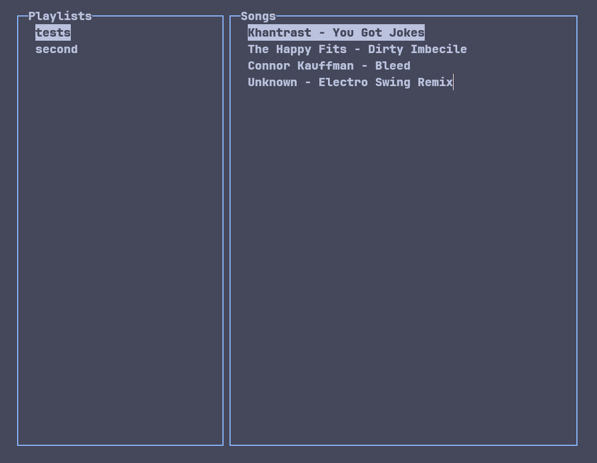

# Nocturne

_noc·​turne_  
A work of art dealing with evening or night

---

  

I listen to a lot of indie bands, and that means a lot of the songs i like on spotify get removed, i made nocturne as a simple music players for 4 reasons:

- I wanted to
- To practice my C++
- to ensure my music collection isnt altered by a company
- To interface with an embedded systems project that I'm working on

## Features

- complete audio control (pause/play, fastforward/rewind, skip/previous song)
- Ncurses TUI display
- JSON-based data storage
- customizable user settings

## Usage

_... TODO ..._

## License

[GNU General Public License v3.0](LICENSE)

## Contact

\> [github](https://github.com/sparrowsaurora)  
\> [email](mailto:sparrows.au@gmail.com)
